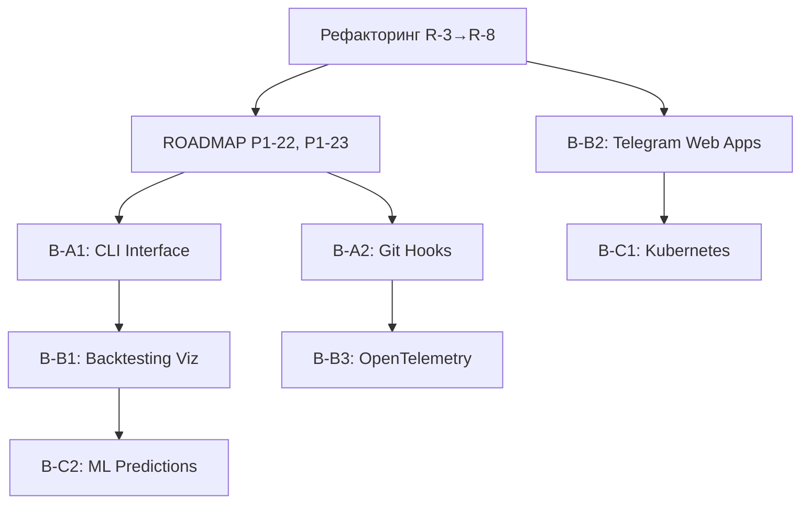

# 📚 Рекомендации из книг: План улучшений

**Дата создания**: 15 декабря 2025
**Статус**: План разработан, ожидает реализации после завершения рефакторинга
**Связан с**: [PROJECT_ROADMAP.md](../PROJECT_ROADMAP.md)

---

## 📋 Оглавление

1. [Обзор](#обзор)
2. [Текущий статус проекта](#текущий-статус-проекта)
3. [Порядок приоритетов](#порядок-приоритетов)
4. [Категории улучшений](#категории-улучшений)
5. [Детальный план реализации](#детальный-план-реализации)
6. [Зависимости и порядок выполнения](#зависимости-и-порядок-выполнения)
7. [Метрики успеха](#метрики-успеха)

---

## 📌 Обзор

Данный документ содержит план улучшений проекта DMarket Telegram Bot, основанный на анализе рекомендаций из технических книг по:

- 🤖 Разработке Telegram ботов
- 🐍 Автоматизации на Python
- 📈 Торговым ботам и алгоритмическому трейдингу
- 🔄 CI/CD и DevOps практикам
- 📊 Git и управлению версиями

### Результаты анализа

| Метрика | Значение |
|---------|----------|
| Всего рекомендаций проанализировано | ~50 |
| Уже реализовано в проекте | ~70% |
| Требует улучшения | ~20% |
| Новые идеи для внедрения | ~10% |

---

## 📊 Текущий статус проекта

> **Важно**: Эти улучшения будут выполняться ПОСЛЕ завершения основного рефакторинга.

### Активная фаза: Рефакторинг (R-серия)

| Задача | Файл | Строк | Статус | Часы |
|--------|------|-------|--------|------|
| R-1 | `dmarket_api.py` | 3239 | ✅ Фаза 1 | - |
| R-2 | `arbitrage_scanner.py` | 2127 | ✅ Завершено | - |
| R-3 | `arbitrage.py` | 1728 | 🔲 Ожидает | 6-8 |
| R-4 | `notifier.py` | 1489 | 🔲 Ожидает | 4-6 |
| R-5 | `keyboards.py` | 1467 | 🔲 Ожидает | 4-6 |
| R-6 | `smart_notifier.py` | 1324 | 🔲 Ожидает | 3-5 |
| R-7 | `game_filter_handlers.py` | 1195 | 🔲 Ожидает | 3-4 |
| R-8 | `targets.py` | 1140 | 🔲 Ожидает | 3-4 |

**Итого рефакторинга**: ~24-37 часов

### После рефакторинга: Книжные улучшения

Эти задачи начнут выполняться после завершения R-3 через R-8.

---

## 🎯 Порядок приоритетов

### Иерархия выполнения

```
1. 🔧 РЕФАКТОРИНГ (R-3 → R-8)     ← Текущий приоритет
        ↓
2. 📋 ROADMAP P1 задачи           ← Критически важные
   - P1-11: MyPy baseline
   - P1-22: Backtesting
   - P1-23: Portfolio management
        ↓
3. 📚 КНИЖНЫЕ УЛУЧШЕНИЯ           ← Этот документ
   - B-1: CLI Interface (совпадает с P2-19)
   - B-2: OpenTelemetry (совпадает с P2-23)
   - B-3: Web Dashboard
   - ...
        ↓
4. 📋 ROADMAP P2/P3 задачи        ← Долгосрочные
```

### Обоснование приоритетов

1. **Рефакторинг первый** — иначе новые фичи будут добавляться в "грязный" код
2. **ROADMAP P1** — критические задачи для production
3. **Книжные улучшения** — повышение качества и DX
4. **ROADMAP P2/P3** — nice-to-have функциональность

---

## 📂 Категории улучшений

### 🟢 Категория A: Быстрые победы (2-8 часов)

Высокий ROI, минимальные изменения, можно делать параллельно с рефакторингом.

| ID | Улучшение | Часы | Источник |
|----|-----------|------|----------|
| B-A1 | CLI Interface (Click/Typer) | 8-12 | Trading Bots книга |
| B-A2 | Расширенные Git hooks | 2-4 | Git книга |
| B-A3 | Issue templates улучшения | 1-2 | GitHub книга |
| B-A4 | Makefile стандартизация | 2-3 | DevOps книга |

### 🟡 Категория B: Средние задачи (10-25 часов)

Существенные улучшения, требуют планирования.

| ID | Улучшение | Часы | Источник |
|----|-----------|------|----------|
| B-B1 | Backtesting визуализация | 15-20 | Trading книга |
| B-B2 | Telegram Web Apps | 20-30 | Telegram книга |
| B-B3 | OpenTelemetry трейсинг | 10-15 | DevOps книга |
| B-B4 | Feature flags система | 8-12 | CI/CD книга |

### 🔴 Категория C: Крупные проекты (30+ часов)

Требуют значительных ресурсов, отдельного планирования.

| ID | Улучшение | Часы | Источник |
|----|-----------|------|----------|
| B-C1 | Kubernetes + Helm | 30-40 | DevOps книга |
| B-C2 | ML ценовые предсказания | 40-60 | Trading книга |
| B-C3 | Cross-platform арбитраж | 30-40 | Trading книга |
| B-C4 | Full-stack Web Dashboard | 40-50 | Telegram книга |

---

## 📋 Детальный план реализации

---

### B-A1: CLI Interface (Click/Typer)

**Приоритет**: 🟢 Высокий
**Время**: 8-12 часов
**Совпадает с**: ROADMAP P2-19
**Статус**: 🔲 Ожидает

#### Цель

Создать полноценный CLI интерфейс для управления ботом без Telegram.

#### Текущее состояние

- ❌ CLI отсутствует
- Управление только через Telegram или Python API

#### Что нужно сделать

```
src/cli/
├── __init__.py
├── main.py              # Точка входа CLI
├── commands/
│   ├── __init__.py
│   ├── scan.py          # Команды сканирования
│   ├── targets.py       # Управление таргетами
│   ├── balance.py       # Проверка баланса
│   ├── config.py        # Управление конфигурацией
│   └── stats.py         # Статистика
└── utils/
    ├── __init__.py
    ├── output.py         # Rich форматирование
    └── progress.py       # Progress bars
```

#### Шаги реализации

1. **Шаг 1** (2-3ч): Базовая структура

   ```bash
   pip install typer[all] rich
   ```

   ```python
   # src/cli/main.py
   import typer
   from rich.console import Console

   app = typer.Typer(help="DMarket Bot CLI")
   console = Console()

   @app.command()
   def scan(
       level: str = typer.Option("standard", help="Уровень арбитража"),
       game: str = typer.Option("csgo", help="Игра")
   ):
       """Запустить сканирование арбитража."""
       console.print(f"[green]Сканирование {level} для {game}...[/green]")
       # ... логика сканирования

   if __name__ == "__main__":
       app()
   ```

2. **Шаг 2** (3-4ч): Основные команды
   - `dmarket scan` — сканирование арбитража
   - `dmarket balance` — проверка баланса
   - `dmarket targets list/create/delete` — управление таргетами
   - `dmarket config show/set` — конфигурация

3. **Шаг 3** (2-3ч): Rich вывод и прогресс
   - Progress bars для долгих операций
   - Таблицы для вывода результатов
   - Цветовое кодирование

4. **Шаг 4** (1-2ч): Документация и тесты
   - README для CLI
   - Unit тесты для команд
   - `--help` документация

#### Результат

```bash
# Примеры использования
dmarket scan --level=boost --game=csgo
dmarket balance
dmarket targets list --status=active
dmarket targets create "AK-47 | Redline" --price=8.50
dmarket stats --period=7d
```

#### Метрики успеха

- [ ] Все команды работают без ошибок
- [ ] Покрытие тестами >80%
- [ ] Документация CLI в docs/

---

### B-A2: Расширенные Git Hooks

**Приоритет**: 🟢 Высокий
**Время**: 2-4 часа
**Статус**: 🔲 Ожидает

#### Цель

Улучшить pre-commit hooks для автоматизации качества кода.

#### Текущее состояние

```yaml
# .pre-commit-config.yaml (текущий)
repos:
  - repo: https://github.com/astral-sh/ruff-pre-commit
    rev: v0.8.6
    hooks:
      - id: ruff
        args: [--fix]
      - id: ruff-format
```

#### Что добавить

```yaml
# .pre-commit-config.yaml (улучшенный)
repos:
  # Существующие
  - repo: https://github.com/astral-sh/ruff-pre-commit
    rev: v0.8.6
    hooks:
      - id: ruff
        args: [--fix]
      - id: ruff-format

  # НОВОЕ: Проверка секретов
  - repo: https://github.com/Yelp/detect-secrets
    rev: v1.4.0
    hooks:
      - id: detect-secrets
        args: ['--baseline', '.secrets.baseline']

  # НОВОЕ: Проверка коммит сообщений
  - repo: https://github.com/commitizen-tools/commitizen
    rev: v3.13.0
    hooks:
      - id: commitizen
        stages: [commit-msg]

  # НОВОЕ: Проверка Markdown
  - repo: https://github.com/igorshubovych/markdownlint-cli
    rev: v0.38.0
    hooks:
      - id: markdownlint
        args: [--fix]

  # НОВОЕ: Проверка YAML
  - repo: https://github.com/adrienverge/yamllint
    rev: v1.33.0
    hooks:
      - id: yamllint
        args: [-c, .yamllint.yml]

  # НОВОЕ: Проверка безопасности
  - repo: https://github.com/PyCQA/bandit
    rev: 1.7.6
    hooks:
      - id: bandit
        args: [-c, pyproject.toml, -r, src/]
```

#### Шаги реализации

1. **Шаг 1** (1ч): Добавить detect-secrets

   ```bash
   detect-secrets scan > .secrets.baseline
   ```

2. **Шаг 2** (0.5ч): Настроить commitizen

   ```toml
   # pyproject.toml
   [tool.commitizen]
   name = "cz_conventional_commits"
   version = "1.0.0"
   tag_format = "v$version"
   ```

3. **Шаг 3** (1ч): Добавить markdownlint и yamllint
   - Создать `.markdownlint.json`
   - Создать `.yamllint.yml`

4. **Шаг 4** (0.5ч): Тестирование

   ```bash
   pre-commit run --all-files
   ```

#### Метрики успеха

- [ ] Все hooks проходят на текущем коде
- [ ] Документация обновлена
- [ ] CI использует те же проверки

---

### B-A3: Issue Templates улучшения

**Приоритет**: 🟢 Средний
**Время**: 1-2 часа
**Статус**: 🔲 Ожидает

#### Текущее состояние

Базовые issue templates существуют.

#### Что добавить

```
.github/
├── ISSUE_TEMPLATE/
│   ├── bug_report.yml         # Улучшить
│   ├── feature_request.yml    # Улучшить
│   ├── refactoring.yml        # НОВОЕ
│   ├── performance.yml        # НОВОЕ
│   └── config.yml
├── PULL_REQUEST_TEMPLATE.md   # Улучшить
└── CODEOWNERS                 # НОВОЕ
```

#### Новый template: refactoring.yml

```yaml
name: 🔧 Рефакторинг
description: Предложение по рефакторингу кода
title: "[REFACTOR] "
labels: ["refactoring", "code-quality"]
body:
  - type: dropdown
    id: module
    attributes:
      label: Модуль
      options:
        - src/dmarket/
        - src/telegram_bot/
        - src/utils/
        - tests/
    validations:
      required: true

  - type: textarea
    id: current-state
    attributes:
      label: Текущее состояние
      placeholder: Опишите текущие проблемы с кодом
    validations:
      required: true

  - type: textarea
    id: proposed-changes
    attributes:
      label: Предлагаемые изменения
      placeholder: Опишите что и как хотите изменить
    validations:
      required: true

  - type: input
    id: estimated-hours
    attributes:
      label: Оценка времени (часы)
      placeholder: "например: 4-6"
```

---

### B-B1: Backtesting визуализация

**Приоритет**: 🟡 Высокий
**Время**: 15-20 часов
**Связан с**: ROADMAP P1-22 (Backtesting система)
**Статус**: 🔲 Ожидает P1-22

#### Цель

Добавить визуализацию результатов бэктестинга с графиками и отчётами.

#### Зависимости

- ⚠️ Требует завершения P1-22 (Backtesting система)
- matplotlib или plotly для графиков
- Jinja2 для HTML отчётов

#### Структура

```
src/backtesting/
├── __init__.py
├── engine.py           # Существует (P1-22)
├── strategies.py       # Существует (P1-22)
├── visualization/      # НОВОЕ
│   ├── __init__.py
│   ├── charts.py       # Генерация графиков
│   ├── reports.py      # HTML/PDF отчёты
│   └── templates/
│       ├── report.html
│       └── styles.css
└── analytics/          # НОВОЕ
    ├── __init__.py
    ├── metrics.py      # Метрики (Sharpe, Sortino, etc.)
    └── comparisons.py  # Сравнение стратегий
```

#### Компоненты визуализации

1. **Графики прибыли**
   - Кумулятивная прибыль по времени
   - Сравнение стратегий
   - Drawdown анализ

2. **Heatmaps**
   - Прибыльность по дням недели/часам
   - Корреляция с объёмами рынка

3. **Статистические таблицы**
   - Win rate, profit factor
   - Sharpe/Sortino ratio
   - Maximum drawdown

4. **HTML отчёты**
   - Интерактивные графики (Plotly)
   - Экспорт в PDF

#### Пример кода

```python
# src/backtesting/visualization/charts.py
import plotly.graph_objects as go
from plotly.subplots import make_subplots

class BacktestVisualizer:
    """Визуализация результатов бэктестинга."""

    def __init__(self, results: BacktestResults):
        self.results = results

    def create_equity_curve(self) -> go.Figure:
        """Создать график эквити."""
        fig = go.Figure()

        fig.add_trace(go.Scatter(
            x=self.results.dates,
            y=self.results.cumulative_pnl,
            mode='lines',
            name='Equity Curve',
            line=dict(color='green', width=2)
        ))

        fig.update_layout(
            title='Equity Curve',
            xaxis_title='Date',
            yaxis_title='Cumulative P&L ($)',
            template='plotly_dark'
        )

        return fig

    def create_drawdown_chart(self) -> go.Figure:
        """Создать график просадок."""
        # ...

    def generate_html_report(self, output_path: str) -> None:
        """Сгенерировать HTML отчёт."""
        # ...
```

#### Метрики успеха

- [ ] 5+ типов графиков реализовано
- [ ] HTML отчёты генерируются
- [ ] Интеграция с Telegram (отправка графиков)
- [ ] Тесты покрытие >80%

---

### B-B2: Telegram Web Apps

**Приоритет**: 🟡 Средний
**Время**: 20-30 часов
**Статус**: 🔲 Ожидает

#### Цель

Создать интерактивный веб-интерфейс внутри Telegram для:

- Дашборд со статистикой
- Настройки бота
- Визуализация арбитража

#### Технологии

- **Frontend**: React/Vue + Telegram Web Apps SDK
- **Backend**: FastAPI endpoint для данных
- **Хостинг**: Cloudflare Pages или Vercel

#### Структура

```
webapp/
├── frontend/
│   ├── src/
│   │   ├── components/
│   │   │   ├── Dashboard.tsx
│   │   │   ├── ArbitrageList.tsx
│   │   │   ├── Settings.tsx
│   │   │   └── Charts.tsx
│   │   ├── hooks/
│   │   │   ├── useTelegram.ts
│   │   │   └── useApi.ts
│   │   └── App.tsx
│   ├── package.json
│   └── vite.config.ts
│
└── backend/
    └── src/webapp_api/
        ├── __init__.py
        ├── main.py           # FastAPI app
        ├── routes/
        │   ├── dashboard.py
        │   ├── arbitrage.py
        │   └── settings.py
        └── auth.py           # Telegram auth validation
```

#### Фазы реализации

**Фаза 1** (8-10ч): Базовый дашборд

- Статистика баланса
- Список последних сделок
- Telegram Web Apps интеграция

**Фаза 2** (8-10ч): Арбитраж интерфейс

- Визуализация возможностей
- Фильтры и сортировка
- Кнопки быстрых действий

**Фаза 3** (4-6ч): Настройки

- Конфигурация уведомлений
- Параметры сканирования
- Управление API ключами

---

### B-B3: OpenTelemetry трейсинг

**Приоритет**: 🟡 Средний
**Время**: 10-15 часов
**Совпадает с**: ROADMAP P2-23 (Observability)
**Статус**: 🔲 Ожидает

#### Цель

Добавить распределённый трейсинг для отслеживания запросов через все компоненты.

#### Текущее состояние

- ✅ Prometheus метрики
- ✅ Sentry error tracking
- ❌ Distributed tracing отсутствует

#### Что добавить

```python
# src/utils/tracing.py
from opentelemetry import trace
from opentelemetry.sdk.trace import TracerProvider
from opentelemetry.sdk.trace.export import BatchSpanProcessor
from opentelemetry.exporter.otlp.proto.grpc.trace_exporter import OTLPSpanExporter
from opentelemetry.instrumentation.httpx import HTTPXClientInstrumentation
from opentelemetry.instrumentation.sqlalchemy import SQLAlchemyInstrumentor

def setup_tracing(service_name: str = "dmarket-bot"):
    """Настроить OpenTelemetry трейсинг."""
    provider = TracerProvider()

    # Экспорт в Jaeger/Tempo
    otlp_exporter = OTLPSpanExporter(
        endpoint=os.getenv("OTEL_EXPORTER_OTLP_ENDPOINT", "localhost:4317")
    )
    provider.add_span_processor(BatchSpanProcessor(otlp_exporter))

    trace.set_tracer_provider(provider)

    # Auto-instrumentation
    HTTPXClientInstrumentation().instrument()
    SQLAlchemyInstrumentor().instrument()

    return trace.get_tracer(service_name)

# Использование
tracer = setup_tracing()

async def scan_arbitrage(level: str, game: str):
    with tracer.start_as_current_span("scan_arbitrage") as span:
        span.set_attribute("level", level)
        span.set_attribute("game", game)

        # ... логика сканирования

        span.set_attribute("opportunities_found", len(results))
        return results
```

#### Интеграция

```yaml
# docker-compose.yml (добавить)
services:
  jaeger:
    image: jaegertracing/all-in-one:latest
    ports:
      - "16686:16686"  # UI
      - "4317:4317"    # OTLP gRPC
    environment:
      - COLLECTOR_OTLP_ENABLED=true
```

---

### B-B4: Feature Flags система

**Приоритет**: 🟡 Низкий
**Время**: 8-12 часов
**Статус**: 🔲 Ожидает

#### Цель

Внедрить систему feature flags для безопасного релиза новых функций.

#### Варианты реализации

1. **Простой вариант**: JSON/YAML конфигурация
2. **Средний вариант**: Redis + админка
3. **Продвинутый**: LaunchDarkly/Unleash интеграция

#### Простая реализация

```python
# src/utils/feature_flags.py
from pydantic import BaseModel
import yaml

class FeatureFlags(BaseModel):
    """Feature flags конфигурация."""

    # Арбитраж
    ultra_level_enabled: bool = False
    cross_platform_arbitrage: bool = False

    # UI
    web_app_enabled: bool = False
    advanced_charts: bool = False

    # Experimental
    ml_predictions: bool = False
    auto_trading: bool = False

    @classmethod
    def load(cls, path: str = "config/features.yaml") -> "FeatureFlags":
        """Загрузить flags из файла."""
        with open(path) as f:
            data = yaml.safe_load(f)
        return cls(**data)

# Singleton
_flags: FeatureFlags | None = None

def get_flags() -> FeatureFlags:
    global _flags
    if _flags is None:
        _flags = FeatureFlags.load()
    return _flags

# Декоратор
def feature_flag(flag_name: str):
    """Декоратор для feature-gated функций."""
    def decorator(func):
        async def wrapper(*args, **kwargs):
            flags = get_flags()
            if not getattr(flags, flag_name, False):
                raise FeatureDisabledError(flag_name)
            return await func(*args, **kwargs)
        return wrapper
    return decorator

# Использование
@feature_flag("ultra_level_enabled")
async def scan_ultra_level():
    """Сканирование ultra уровня (feature-gated)."""
    # ...
```

---

### B-C1: Kubernetes + Helm

**Приоритет**: 🔴 Низкий (для production)
**Время**: 30-40 часов
**Совпадает с**: ROADMAP P2-10
**Статус**: 🔲 Ожидает

#### Цель

Подготовить проект для деплоя в Kubernetes.

#### Структура

```
k8s/
├── base/
│   ├── deployment.yaml
│   ├── service.yaml
│   ├── configmap.yaml
│   ├── secret.yaml
│   └── kustomization.yaml
├── overlays/
│   ├── dev/
│   │   ├── kustomization.yaml
│   │   └── patch-replicas.yaml
│   ├── staging/
│   │   └── ...
│   └── production/
│       └── ...
└── helm/
    └── dmarket-bot/
        ├── Chart.yaml
        ├── values.yaml
        ├── templates/
        │   ├── deployment.yaml
        │   ├── service.yaml
        │   ├── ingress.yaml
        │   ├── hpa.yaml
        │   └── ...
        └── charts/
            ├── postgresql/
            └── redis/
```

#### Фазы

**Фаза 1** (10-12ч): Kubernetes манифесты

- Deployment, Service, ConfigMap, Secret
- Kustomize для разных окружений

**Фаза 2** (12-15ч): Helm Chart

- Параметризация всех значений
- Sub-charts для зависимостей
- values.yaml для каждого окружения

**Фаза 3** (8-10ч): CI/CD интеграция

- GitHub Actions для деплоя
- ArgoCD конфигурация (опционально)
- Rollback стратегии

---

### B-C2: ML ценовые предсказания

**Приоритет**: 🔴 Низкий (исследование)
**Время**: 40-60 часов
**Совпадает с**: ROADMAP P3-1
**Статус**: 🔲 Ожидает (исследование)

#### Цель

Использовать ML для предсказания изменений цен и улучшения арбитражных решений.

> **Примечание**: Это исследовательская задача. Успех не гарантирован.

#### Подход

1. **Сбор данных** (10-15ч)
   - Исторические цены (sales_history)
   - Объёмы торгов
   - Внешние факторы (обновления игры, турниры)

2. **Feature Engineering** (8-10ч)
   - Технические индикаторы (SMA, EMA, RSI)
   - Lag features
   - Seasonal patterns

3. **Модели** (15-20ч)
   - Baseline: Linear Regression
   - Улучшение: Random Forest, XGBoost
   - Advanced: LSTM/Transformer (если достаточно данных)

4. **Интеграция** (10-15ч)
   - API endpoint для предсказаний
   - Интеграция в arbitrage_scanner
   - A/B тестирование

#### Осторожно

⚠️ **Риски:**

- Рынок игровых предметов непредсказуем
- Недостаточно данных для сложных моделей
- Overfitting на исторических данных
- Изменения в игре делают модель устаревшей

---

## 🔗 Зависимости и порядок выполнения



### Рекомендуемый порядок

| Порядок | Задача | Зависит от | Оценка |
|---------|--------|------------|--------|
| 1 | R-3 → R-8 | — | 24-37ч |
| 2 | P1-22 Backtesting | R-серия | 15-20ч |
| 3 | P1-23 Portfolio | R-серия | 12-16ч |
| 4 | B-A1 CLI | — | 8-12ч |
| 5 | B-A2 Git Hooks | — | 2-4ч |
| 6 | B-B1 Backtesting Viz | P1-22 | 15-20ч |
| 7 | B-B3 OpenTelemetry | — | 10-15ч |
| 8 | B-B2 Web Apps | R-серия | 20-30ч |
| 9 | B-C1 Kubernetes | — | 30-40ч |
| 10 | B-C2 ML | P1-22, данные | 40-60ч |

---

## 📈 Метрики успеха

### Количественные

| Метрика | Текущее | Цель | После книжных улучшений |
|---------|---------|------|-------------------------|
| Test Coverage | ~25% | 80% | 85%+ |
| MyPy Errors | 885 | <100 | 0 |
| CLI Commands | 0 | — | 10+ |
| Response Time | — | <2s | <1s |
| Deployment Time | — | — | <5min |

### Качественные

- [ ] CLI полностью функционален
- [ ] Backtesting с визуализацией работает
- [ ] OpenTelemetry трейсинг настроен
- [ ] Все hooks проходят
- [ ] Документация актуальна

---

## 📝 Чеклист перед началом работы

### Перед каждой задачей

- [ ] Проверить что рефакторинг (R-серия) завершён
- [ ] Проверить зависимости задачи
- [ ] Создать feature branch: `feature/book-{id}`
- [ ] Прочитать связанную документацию
- [ ] Подготовить тесты

### После завершения

- [ ] Все тесты проходят
- [ ] MyPy без ошибок
- [ ] Ruff без warnings
- [ ] Документация обновлена
- [ ] PR создан и одобрен
- [ ] Задача отмечена в этом файле

---

## 📚 Ссылки на источники

### Книги-источники

1. **Telegram Bot Development** — Interactive UI, Web Apps
2. **Python Automation Cookbook** — CLI, scheduling
3. **Building Trading Bots** — Backtesting, visualization
4. **DevOps with Kubernetes** — K8s, Helm, observability
5. **Git для профессионалов** — Hooks, workflows

### Связанные документы

- [PROJECT_ROADMAP.md](../PROJECT_ROADMAP.md) — Основной roadmap
- [ARCHITECTURE.md](ARCHITECTURE.md) — Архитектура проекта
- [CONTRIBUTING.md](CONTRIBUTING.md) — Гайд по контрибуции
- [testing_guide.md](testing_guide.md) — Гайд по тестированию

---

**Последнее обновление**: 15 декабря 2025
**Автор**: GitHub Copilot
**Статус документа**: ✅ Финальный
