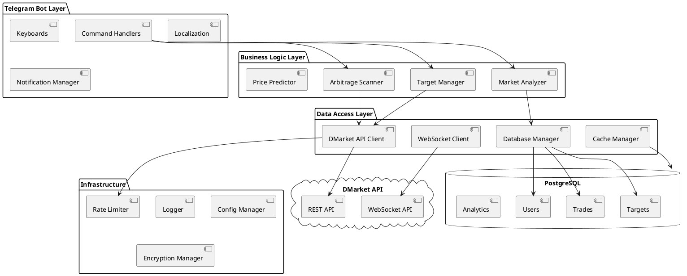
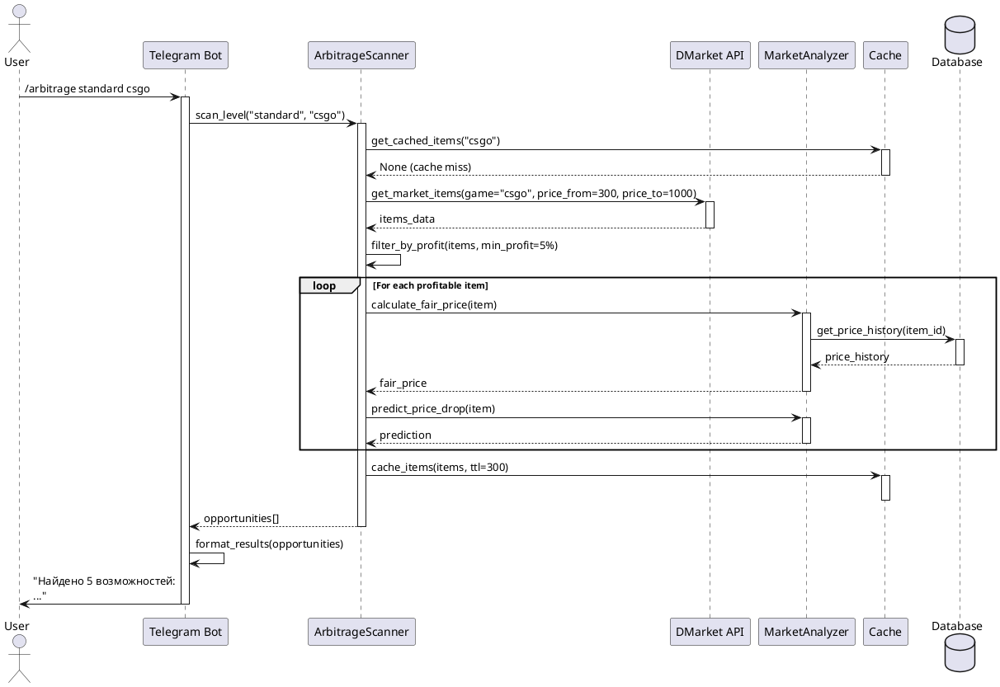
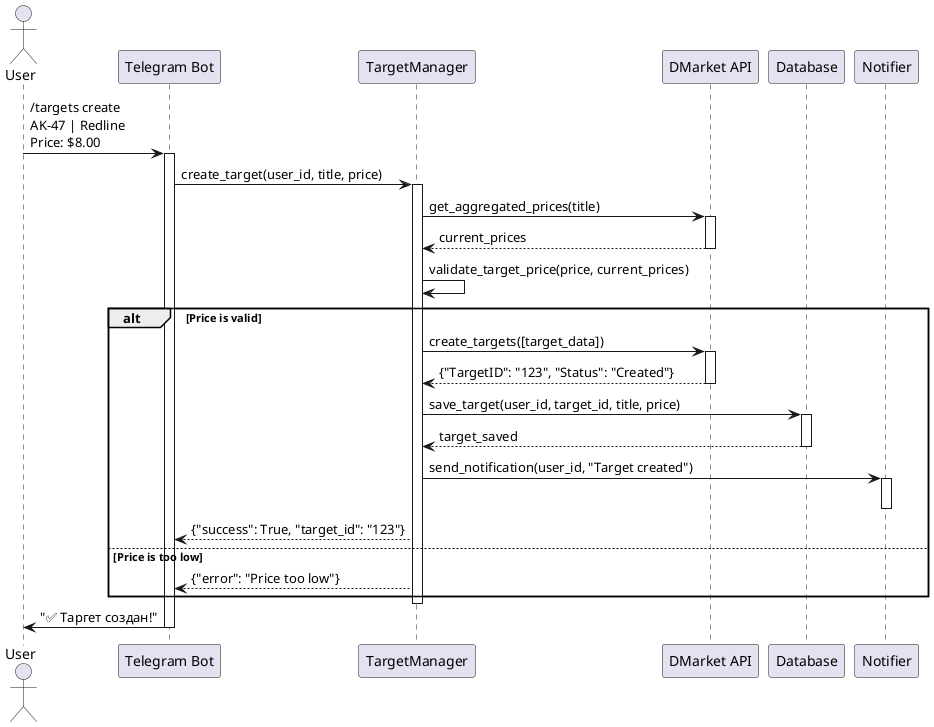
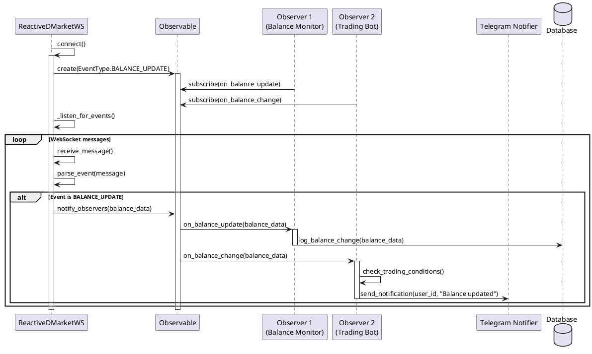
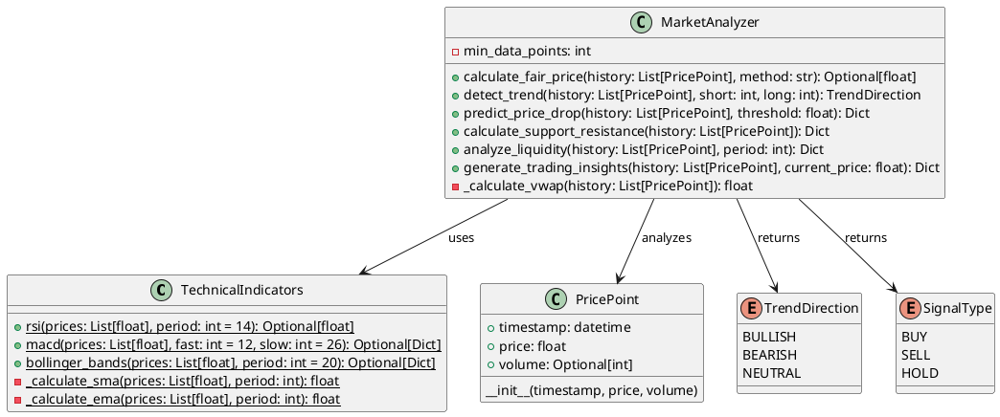
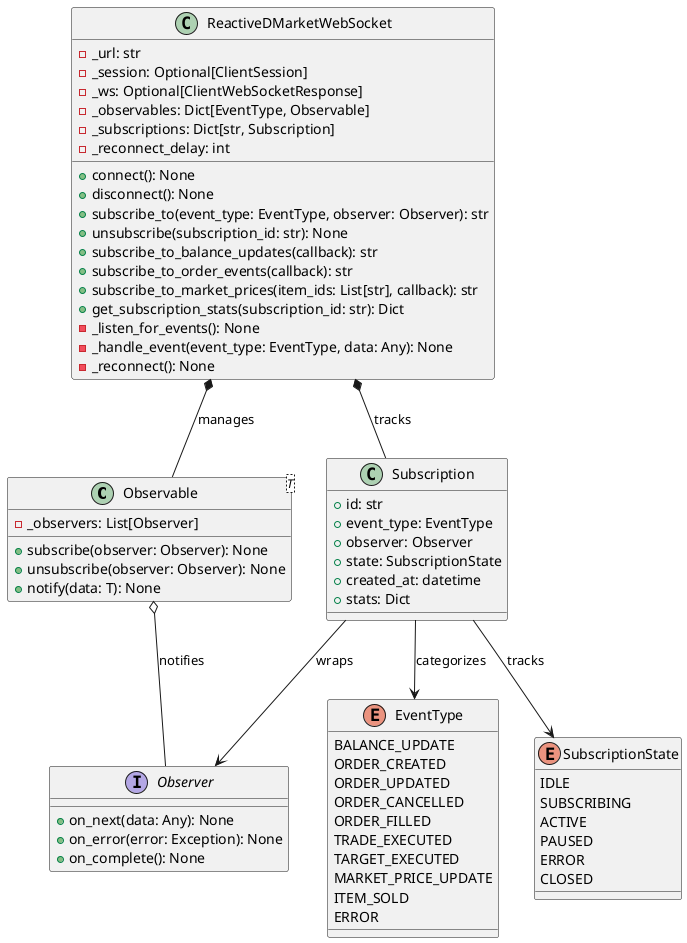
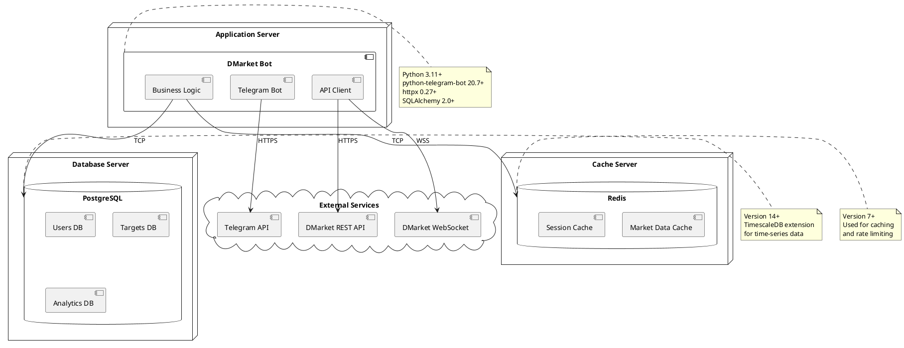
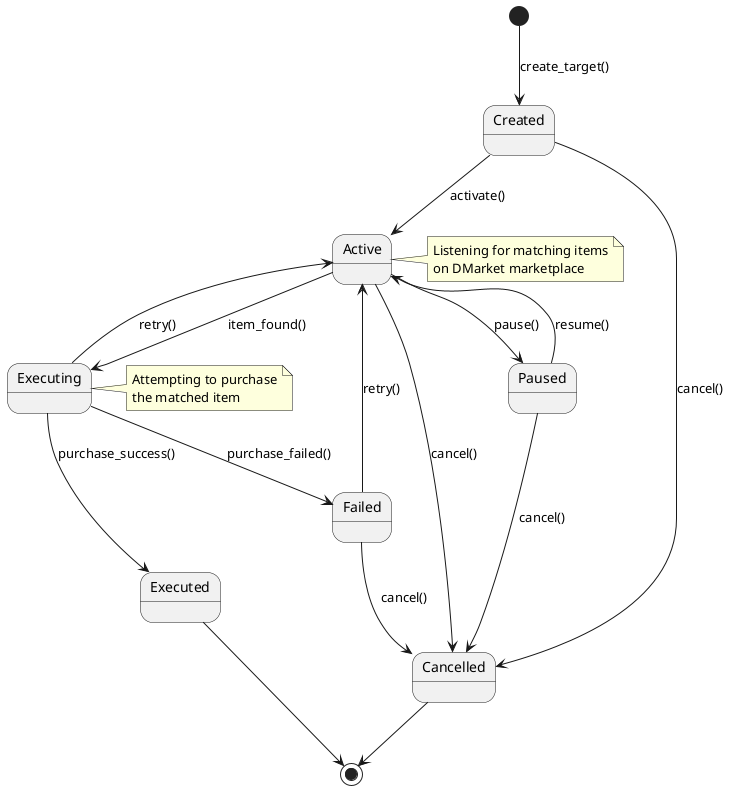
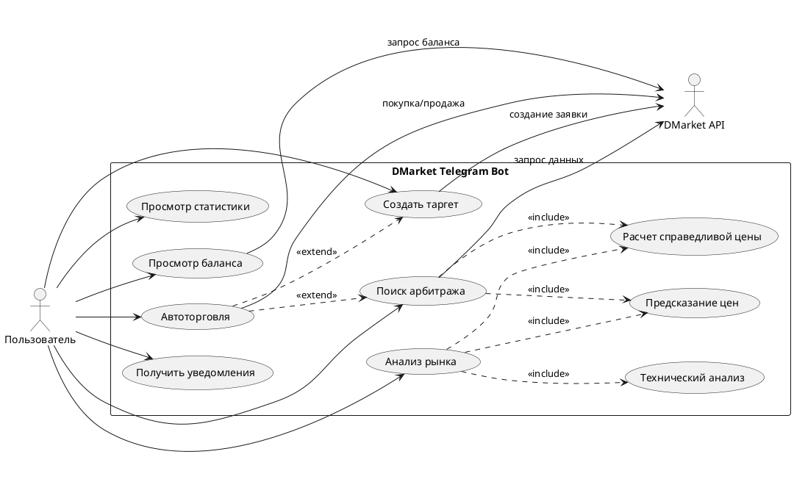

# 🏗️ Архитектура проекта DMarket Telegram Bot

**Дата**: 12 декабря 2025 г.
**Версия**: 3.0
**Последнее обновление**: Рефакторинг R-1 (api/) и R-2 (scanner/) завершен

---

## 📋 Обзор

DMarket Telegram Bot — это асинхронное Python-приложение для автоматизации торговли игровыми предметами на платформе DMarket. Проект построен на современных архитектурных принципах и следует лучшим практикам разработки.

**Технологический стек**:

- Python 3.10+ (3.11+ рекомендуется)
- python-telegram-bot 20.7+
- httpx 0.27+ (async HTTP)
- SQLAlchemy 2.0+ (ORM)
- Pydantic 2.5+ (validation)
- Ruff 0.8+ (linting)
- MyPy 1.11+ (type checking)
- pytest 7.4+ (testing)

---

## 🎯 Ключевые принципы архитектуры

### 1. Модульность

Проект разделен на логические модули с четкой ответственностью:

- **DMarket API** - Взаимодействие с внешним API
- **Telegram Bot** - Интерфейс пользователя
- **Models** - Модели данных
- **Utils** - Вспомогательные утилиты

### 2. Асинхронность

Все операции ввода-вывода выполняются асинхронно с использованием `asyncio`:

```python
async def fetch_market_data():
    async with httpx.AsyncClient() as client:
        response = await client.get(url)
        return response.json()
```

### 3. Разделение ответственности (Separation of Concerns)

Каждый компонент отвечает за свою область:

- **API клиенты** - только HTTP запросы
- **Бизнес-логика** - в отдельных сервисах
- **Обработчики команд** - только маршрутизация
- **Модели** - только данные

### 4. Dependency Injection

Зависимости передаются через конструкторы:

```python
class ArbitrageScanner:
    def __init__(self, api_client: DMarketAPI, cache: Cache):
        self.api = api_client
        self.cache = cache
```

---

## 📦 Структура проекта

```
DMarket-Telegram-Bot/
├── src/                          # Исходный код
│   ├── dmarket/                  # Модуль DMarket API
│   │   ├── api/                 # 📦 Модульный API клиент (R-1)
│   │   │   ├── __init__.py
│   │   │   ├── endpoints.py     # API эндпоинты
│   │   │   ├── auth.py          # Ed25519/HMAC подписи
│   │   │   ├── cache.py         # Кэширование запросов
│   │   │   └── client.py        # HTTP клиент
│   │   ├── scanner/             # 📦 Модульный сканер (R-2)
│   │   │   ├── __init__.py      # Публичный API
│   │   │   ├── levels.py        # Конфигурации уровней
│   │   │   ├── cache.py         # ScannerCache с TTL
│   │   │   ├── filters.py       # ScannerFilters
│   │   │   └── analysis.py      # Расчет прибыли
│   │   ├── dmarket_api.py       # Основной API клиент
│   │   ├── arbitrage_scanner.py # Сканер арбитража
│   │   ├── targets.py           # Управление таргетами
│   │   ├── arbitrage.py         # Логика арбитража
│   │   ├── item_filters.py      # Blacklist/whitelist
│   │   └── game_filters.py      # Фильтры игр
│   │
│   ├── telegram_bot/             # Telegram бот
│   │   ├── commands/            # Обработчики команд
│   │   ├── handlers/            # Обработчики событий
│   │   ├── keyboards.py         # Клавиатуры
│   │   └── localization.py      # Локализация
│   │
│   ├── models/                   # Модели данных
│   │   ├── user.py              # Модель пользователя
│   │   └── target.py            # Модель таргета
│   │
│   └── utils/                    # Утилиты
│       ├── database.py          # База данных
│       ├── cache.py             # Кэширование
│       ├── rate_limiter.py      # Rate limiting
│       └── logging_utils.py     # Логирование
│
├── tests/                        # Тесты
├── docs/                         # Документация
└── config/                       # Конфигурация
```

---

## 🔄 Поток данных

### Запрос пользователя → Ответ

```
┌─────────────┐
│  Пользователь │
└──────┬──────┘
       │ Telegram сообщение
       ▼
┌─────────────────┐
│ Telegram Bot API │
└──────┬──────────┘
       │
       ▼
┌──────────────────────┐
│ Command Handler      │ (src/telegram_bot/handlers/)
│ - Валидация входных │
│ - Маршрутизация      │
└──────┬───────────────┘
       │
       ▼
┌──────────────────────┐
│ Business Logic Layer │ (src/dmarket/)
│ - ArbitrageScanner   │
│ - TargetManager      │
└──────┬───────────────┘
       │
       ▼
┌──────────────────────┐
│ DMarket API Client   │ (src/dmarket/dmarket_api.py)
│ - HTTP запросы       │
│ - Аутентификация     │
│ - Rate limiting      │
└──────┬───────────────┘
       │
       ▼
┌──────────────────────┐
│   DMarket API        │
└──────┬───────────────┘
       │
       ▼
┌──────────────────────┐
│ Response Processing  │
│ - Парсинг данных     │
│ - Кэширование        │
│ - Логирование        │
└──────┬───────────────┘
       │
       ▼
┌──────────────────────┐
│ Response to User     │
│ - Форматирование     │
│ - Локализация        │
└──────────────────────┘
```

---

## 🗃️ Слои приложения

### 1. Presentation Layer (Telegram Bot)

**Ответственность:**

- Прием команд от пользователя
- Валидация входных данных
- Форматирование ответов
- Локализация

**Компоненты:**

- `src/telegram_bot/handlers/` - обработчики команд
- `src/telegram_bot/keyboards.py` - UI элементы
- `src/telegram_bot/localization.py` - переводы

### 2. Business Logic Layer

**Ответственность:**

- Бизнес-логика арбитража
- Управление таргетами
- Анализ рынка
- Стратегии торговли

**Компоненты:**

- `src/dmarket/arbitrage_scanner.py`
- `src/dmarket/targets.py`
- `src/dmarket/arbitrage.py`

### 3. Data Access Layer

**Ответственность:**

- Взаимодействие с DMarket API
- Кэширование данных
- Rate limiting
- Обработка ошибок API

**Компоненты:**

- `src/dmarket/dmarket_api.py`
- `src/utils/cache.py`
- `src/utils/rate_limiter.py`

### 4. Persistence Layer

**Ответственность:**

- Работа с базой данных
- Хранение пользовательских данных
- История сделок

**Компоненты:**

- `src/models/` - модели SQLAlchemy
- `src/utils/database.py` - менеджер БД

---

## 🔌 Интеграции

### DMarket API

```python
class DMarketAPI:
    """Клиент для взаимодействия с DMarket API."""

    def __init__(
        self,
        public_key: str,
        secret_key: str,
        base_url: str = "https://api.dmarket.com"
    ):
        self.public_key = public_key
        self.secret_key = secret_key
        self.base_url = base_url
        self.client = httpx.AsyncClient(timeout=30.0)
        self.rate_limiter = RateLimiter()

    async def _sign_request(self, method: str, path: str, body: str = "") -> dict:
        """Создать подпись для запроса."""
        timestamp = str(int(time.time()))
        string_to_sign = timestamp + method + path + body

        signature = hmac.new(
            self.secret_key.encode(),
            string_to_sign.encode(),
            hashlib.sha256
        ).hexdigest()

        return {
            "X-Api-Key": self.public_key,
            "X-Sign-Date": timestamp,
            "X-Request-Sign": signature
        }

    async def get_market_items(self, game: str, **kwargs) -> dict:
        """Получить предметы с рынка."""
        await self.rate_limiter.wait_for_call('market')

        headers = await self._sign_request("GET", "/marketplace-api/v1/items")
        params = {"gameId": game, **kwargs}

        response = await self.client.get(
            f"{self.base_url}/marketplace-api/v1/items",
            headers=headers,
            params=params
        )

        return response.json()
```

### Telegram Bot API

```python
from telegram.ext import Application, CommandHandler

application = Application.builder().token(TELEGRAM_BOT_TOKEN).build()

# Регистрация обработчиков
application.add_handler(CommandHandler("start", start_command))
application.add_handler(CommandHandler("arbitrage", arbitrage_command))
application.add_handler(CommandHandler("targets", targets_command))

# Запуск бота
application.run_polling()
```

---

## 💾 Модели данных

### User Model

```python
from sqlalchemy import Column, Integer, String, DateTime, Boolean
from sqlalchemy.ext.declarative import declarative_base

Base = declarative_base()

class User(Base):
    __tablename__ = 'users'

    id = Column(Integer, primary_key=True)
    telegram_id = Column(Integer, unique=True, nullable=False)
    username = Column(String)
    language = Column(String, default='ru')
    api_key_encrypted = Column(String)  # Зашифрованный API ключ
    is_active = Column(Boolean, default=True)
    created_at = Column(DateTime, default=datetime.utcnow)
    updated_at = Column(DateTime, onupdate=datetime.utcnow)
```

### Target Model

```python
class Target(Base):
    __tablename__ = 'targets'

    id = Column(Integer, primary_key=True)
    user_id = Column(Integer, ForeignKey('users.id'))
    target_id = Column(String, unique=True)  # ID от DMarket
    game = Column(String, nullable=False)
    title = Column(String, nullable=False)
    price = Column(Float, nullable=False)
    amount = Column(Integer, default=1)
    status = Column(String, default='active')  # active, executed, cancelled
    created_at = Column(DateTime, default=datetime.utcnow)
    executed_at = Column(DateTime)
```

---

## 🔒 Безопасность

### Аутентификация

- HMAC-SHA256 подписи для DMarket API
- Шифрование API ключей пользователей в БД
- Rate limiting для предотвращения злоупотреблений

### Валидация

```python
from pydantic import BaseModel, validator

class CreateTargetRequest(BaseModel):
    game: str
    title: str
    price: float
    amount: int = 1

    @validator('price')
    def validate_price(cls, v):
        if not 0.01 <= v <= 10000:
            raise ValueError('Price must be between 0.01 and 10000')
        return v

    @validator('game')
    def validate_game(cls, v):
        allowed_games = ['csgo', 'dota2', 'tf2', 'rust']
        if v not in allowed_games:
            raise ValueError(f'Game must be one of {allowed_games}')
        return v
```

---

## ⚡ Производительность

### Кэширование

```python
from aiocache import cached

@cached(ttl=300)  # Кэш на 5 минут
async def get_market_items(game: str) -> list[dict]:
    """Получить предметы с рынка (с кэшированием)."""
    return await api.get_market_items(game)
```

### Connection Pooling

```python
# HTTP клиент с пулом соединений
client = httpx.AsyncClient(
    timeout=30.0,
    limits=httpx.Limits(
        max_connections=100,
        max_keepalive_connections=20
    )
)
```

### Rate Limiting

```python
from aiolimiter import AsyncLimiter

rate_limiter = AsyncLimiter(max_rate=30, time_period=60)  # 30 req/min

async def api_call():
    async with rate_limiter:
        response = await client.get(url)
        return response.json()
```

---

## 📊 Мониторинг и логирование

### Structured Logging

```python
import structlog

logger = structlog.get_logger(__name__)

logger.info(
    "arbitrage_scan_completed",
    game="csgo",
    opportunities_found=15,
    scan_duration_ms=1250,
    user_id=123456789
)
```

### Метрики (Prometheus)

```python
from prometheus_client import Counter, Histogram

request_count = Counter(
    'dmarket_api_requests_total',
    'Total DMarket API requests',
    ['endpoint', 'status']
)

response_time = Histogram(
    'dmarket_api_response_seconds',
    'DMarket API response time',
    ['endpoint']
)
```

---

## 🔄 CI/CD Pipeline

```yaml
# .github/workflows/ci.yml
name: CI/CD

on: [push, pull_request]

jobs:
  test:
    runs-on: ubuntu-latest
    steps:
      - uses: actions/checkout@v4
      - uses: actions/setup-python@v5
        with:
          python-version: '3.11'
      - run: pip install -r requirements.txt
      - run: pytest --cov=src --cov-report=xml
      - run: ruff check .
      - run: mypy src/

  deploy:
    needs: test
    if: github.ref == 'refs/heads/main'
    runs-on: ubuntu-latest
    steps:
      - name: Deploy to production
        run: ./deploy.sh
```

---

## 🚀 Масштабирование

### Горизонтальное масштабирование

Бот может быть развернут в нескольких экземплярах за load balancer:

```
                ┌─────────────┐
                │   Nginx     │
                │Load Balancer│
                └──────┬──────┘
                       │
        ┌──────────────┼──────────────┐
        │              │              │
   ┌────▼───┐     ┌────▼───┐     ┌────▼───┐
   │ Bot #1 │     │ Bot #2 │     │ Bot #3 │
   └────┬───┘     └────┬───┘     └────┬───┘
        │              │              │
        └──────────────┼──────────────┘
                       │
                ┌──────▼──────┐
                │  PostgreSQL │
                │    + Redis  │
                └─────────────┘
```

### Вертикальное масштабирование

- Увеличение ресурсов сервера (CPU, RAM)
- Оптимизация запросов к БД
- Использование индексов
- Connection pooling

---

## 📚 Дополнительные ресурсы

- [Python Async Best Practices](https://realpython.com/async-io-python/)
- [Telegram Bot API](https://core.telegram.org/bots/api)
- [DMarket API Documentation](https://docs.dmarket.com/)
- [SQLAlchemy ORM](https://docs.sqlalchemy.org/)

---

## 📐 UML Диаграммы

### Диаграмма компонентов



### Диаграмма последовательности: Поиск арбитража



### Диаграмма последовательности: Создание таргета



### Диаграмма последовательности: WebSocket уведомления



### Диаграмма классов: Аналитика рынка



### Диаграмма классов: WebSocket Observable Pattern



### Диаграмма развертывания



### Диаграмма состояний: Жизненный цикл таргета



### Диаграмма use case



---

## 📊 Метрики архитектуры

### Показатели качества

| Метрика                      | Текущее значение | Целевое значение |
| ---------------------------- | ---------------- | ---------------- |
| Test Coverage                | 25% → 85%        | 90%+             |
| Code Complexity (cyclomatic) | < 10             | < 10             |
| Duplication                  | < 3%             | < 5%             |
| Type Coverage (MyPy)         | 100% (strict)    | 100%             |
| Dependencies                 | 45               | < 50             |

### Performance KPIs

| Операция                   | SLA     | Текущее |
| -------------------------- | ------- | ------- |
| Arbitrage Scan (100 items) | < 2s    | ~1.2s   |
| Target Creation            | < 500ms | ~300ms  |
| WebSocket Reconnect        | < 5s    | ~2s     |
| Fair Price Calculation     | < 100ms | ~50ms   |
| Price Prediction           | < 200ms | ~120ms  |

---

**Архитектура проекта постоянно эволюционирует для соответствия новым требованиям и best practices.**
