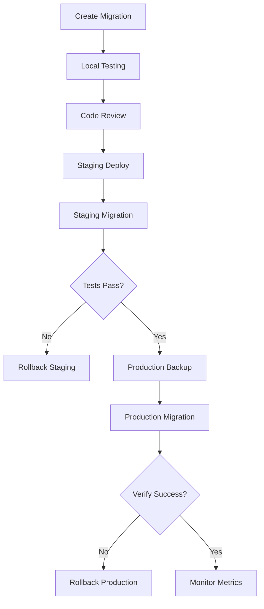

# 🗄️ Database Migration Strategy

## Обзор

Стратегия безопасных миграций базы данных для DMarket Telegram Bot с использованием Alembic.

## 🎯 Принципы

### 1. Backward Compatibility

**Всегда создавать обратно совместимые миграции:**

✅ **Правильно:**
```python
# Добавление nullable колонки
op.add_column('users', sa.Column('new_field', sa.String(), nullable=True))
```

❌ **Неправильно:**
```python
# NOT NULL без значения по умолчанию
op.add_column('users', sa.Column('new_field', sa.String(), nullable=False))
```

### 2. Multi-Step Migrations

**Для breaking changes используйте несколько шагов:**

**Шаг 1**: Добавить новую колонку (nullable)
```python
op.add_column('users', sa.Column('email_new', sa.String(), nullable=True))
```

**Шаг 2**: Мигрировать данные
```python
op.execute("UPDATE users SET email_new = email WHERE email IS NOT NULL")
```

**Шаг 3**: Сделать NOT NULL
```python
op.alter_column('users', 'email_new', nullable=False)
```

**Шаг 4**: Удалить старую колонку
```python
op.drop_column('users', 'email')
op.alter_column('users', 'email_new', new_column_name='email')
```

### 3. Zero-Downtime Deployment

**Стратегия Blue-Green для критичных миграций:**

1. **Deploy V1** с обратно совместимой миграцией
2. **Запустить миграцию** данных
3. **Deploy V2** с использованием новых полей
4. **Cleanup миграция** удаляет старые поля

## 📋 Checklist перед миграцией

### Pre-Migration

- [ ] **Backup базы данных**
  ```bash
  python scripts/backup_database.py --full
  ```

- [ ] **Тестирование на копии**
  ```bash
  python scripts/test_migration.py --migration-id abc123
  ```

- [ ] **Review миграции** командой
  - Проверка на breaking changes
  - Проверка индексов
  - Проверка constraints

- [ ] **Dry-run миграции**
  ```bash
  alembic upgrade head --sql > migration.sql
  # Проверить SQL вручную
  ```

### During Migration

- [ ] **Мониторинг метрик**
  - Database connections
  - Query performance
  - Error rates

- [ ] **Communication**
  - Уведомить команду
  - Maintenance mode (если нужно)

### Post-Migration

- [ ] **Verify данные**
  ```bash
  python scripts/verify_migration.py --check-integrity
  ```

- [ ] **Performance тесты**
  ```bash
  python scripts/benchmark_queries.py
  ```

- [ ] **Rollback план готов**
  ```bash
  alembic downgrade -1
  ```

## 🔒 Типы миграций

### Type 1: Safe Migrations (No Downtime)

**Примеры:**
- Добавление nullable колонки
- Добавление таблицы
- Добавление индекса CONCURRENTLY (PostgreSQL)

**Процесс:**
```bash
# 1. Создать миграцию
alembic revision --autogenerate -m "add_user_preferences_table"

# 2. Review и edit
vim alembic/versions/abc123_add_user_preferences_table.py

# 3. Test на dev
alembic upgrade head

# 4. Deploy без downtime
python scripts/safe_migrate.py
```

### Type 2: Careful Migrations (Minimal Downtime)

**Примеры:**
- Изменение типа колонки
- Добавление NOT NULL constraint
- Удаление колонки

**Процесс:**
```bash
# 1. Multi-step migration
alembic revision -m "step1_add_new_column"
alembic revision -m "step2_migrate_data"
alembic revision -m "step3_drop_old_column"

# 2. Deploy каждый шаг отдельно
alembic upgrade +1
# Wait and verify
alembic upgrade +1
# Wait and verify
alembic upgrade +1
```

### Type 3: Risky Migrations (Downtime Required)

**Примеры:**
- Изменение primary key
- Сложные data migrations
- Реструктуризация таблиц

**Процесс:**
```bash
# 1. Maintenance mode
python scripts/enable_maintenance.py

# 2. Full backup
python scripts/backup_database.py --full

# 3. Execute migration
alembic upgrade head

# 4. Verify extensively
python scripts/verify_migration.py --full-check

# 5. Disable maintenance
python scripts/disable_maintenance.py
```

## 🛠️ Safe Migration Patterns

### Adding Column

```python
def upgrade():
    # ✅ Correct: nullable first
    op.add_column('users', sa.Column('telegram_username', sa.String(255), nullable=True))

    # Then populate
    op.execute("UPDATE users SET telegram_username = 'unknown' WHERE telegram_username IS NULL")

    # Then make NOT NULL
    op.alter_column('users', 'telegram_username', nullable=False)

def downgrade():
    op.drop_column('users', 'telegram_username')
```

### Renaming Column

```python
def upgrade():
    # Step 1: Add new column
    op.add_column('users', sa.Column('user_id', sa.BigInteger(), nullable=True))

    # Step 2: Copy data
    op.execute("UPDATE users SET user_id = telegram_id")

    # Step 3: Make NOT NULL
    op.alter_column('users', 'user_id', nullable=False)

    # Step 4: Create index before dropping old column
    op.create_index('ix_users_user_id', 'users', ['user_id'])

    # Step 5: Drop old (in next migration!)
    # op.drop_column('users', 'telegram_id')

def downgrade():
    op.add_column('users', sa.Column('telegram_id', sa.BigInteger(), nullable=True))
    op.execute("UPDATE users SET telegram_id = user_id")
    op.alter_column('users', 'telegram_id', nullable=False)
    op.drop_column('users', 'user_id')
```

### Changing Column Type

```python
def upgrade():
    # PostgreSQL: Use USING clause
    op.execute("""
        ALTER TABLE items
        ALTER COLUMN price
        TYPE DECIMAL(10,2)
        USING price::DECIMAL(10,2)
    """)

    # SQLite: Recreate table (handled by Alembic)
    with op.batch_alter_table('items') as batch_op:
        batch_op.alter_column('price',
            type_=sa.DECIMAL(10, 2),
            existing_type=sa.Integer())

def downgrade():
    # Reverse: потеря precision!
    op.execute("ALTER TABLE items ALTER COLUMN price TYPE INTEGER USING price::INTEGER")
```

### Adding Index

```python
def upgrade():
    # PostgreSQL: CONCURRENTLY to avoid table lock
    op.create_index(
        'ix_users_created_at',
        'users',
        ['created_at'],
        postgresql_concurrently=True
    )

def downgrade():
    op.drop_index('ix_users_created_at', 'users')
```

## 📊 Data Integrity Checks

### Pre-Migration Checks

```python
# scripts/verify_migration.py

async def check_data_integrity(session: AsyncSession) -> dict[str, bool]:
    """Verify data integrity before migration."""
    checks = {}

    # Check 1: No orphaned records
    result = await session.execute(
        "SELECT COUNT(*) FROM targets WHERE user_id NOT IN (SELECT id FROM users)"
    )
    checks['no_orphans'] = result.scalar() == 0

    # Check 2: All prices positive
    result = await session.execute(
        "SELECT COUNT(*) FROM items WHERE price < 0"
    )
    checks['valid_prices'] = result.scalar() == 0

    # Check 3: Unique constraints
    result = await session.execute(
        "SELECT telegram_id, COUNT(*) FROM users GROUP BY telegram_id HAVING COUNT(*) > 1"
    )
    checks['unique_telegram_id'] = len(result.all()) == 0

    return checks
```

### Post-Migration Checks

```python
async def verify_migration_success(session: AsyncSession, migration_id: str) -> bool:
    """Verify migration completed successfully."""

    # Check 1: Row count unchanged (for data migrations)
    before_count = await get_table_count('users', before_migration=True)
    after_count = await get_table_count('users')

    if before_count != after_count:
        logger.error(f"Row count mismatch: {before_count} -> {after_count}")
        return False

    # Check 2: No NULL values in NOT NULL columns
    result = await session.execute(
        "SELECT COUNT(*) FROM users WHERE required_field IS NULL"
    )

    if result.scalar() > 0:
        logger.error("Found NULL values in NOT NULL column")
        return False

    return True
```

## 🔄 Rollback Strategy

### Automatic Rollback

```python
# scripts/safe_migrate.py

async def safe_migrate(target_revision: str = 'head') -> bool:
    """
    Безопасная миграция с автоматическим rollback при ошибке.

    Returns:
        True если успешно, False если откатилась
    """
    # 1. Backup
    backup_file = await create_backup()
    logger.info(f"Backup created: {backup_file}")

    # 2. Pre-migration checks
    if not await check_data_integrity():
        logger.error("Pre-migration checks failed")
        return False

    current_revision = get_current_revision()

    try:
        # 3. Apply migration
        alembic_upgrade(target_revision)

        # 4. Post-migration checks
        if not await verify_migration_success(target_revision):
            raise MigrationVerificationError("Post-migration checks failed")

        logger.info(f"Migration {target_revision} completed successfully")
        return True

    except Exception as e:
        logger.error(f"Migration failed: {e}")

        # Automatic rollback
        logger.info(f"Rolling back to {current_revision}")
        alembic_downgrade(current_revision)

        # Verify rollback
        if await check_data_integrity():
            logger.info("Rollback successful")
        else:
            logger.critical("Rollback verification failed! Manual intervention required")
            await send_alert("CRITICAL: Migration rollback verification failed")

        return False
```

### Manual Rollback

```bash
# Rollback one migration
alembic downgrade -1

# Rollback to specific revision
alembic downgrade abc123

# Rollback all migrations
alembic downgrade base

# Show migration history
alembic history --verbose

# Current revision
alembic current
```

## 🧪 Testing Migrations

### Local Testing

```bash
# 1. Create test database copy
python scripts/copy_prod_to_test.py

# 2. Test migration
alembic -c alembic_test.ini upgrade head

# 3. Run integration tests
pytest tests/integration/ -v

# 4. Benchmark queries
python scripts/benchmark_queries.py --before --after
```

### CI/CD Integration

```yaml
# .github/workflows/migration-test.yml
name: Test Database Migration

on:
  pull_request:
    paths:
      - 'alembic/versions/*.py'

jobs:
  test-migration:
    runs-on: ubuntu-latest

    services:
      postgres:
        image: postgres:15
        env:
          POSTGRES_DB: test_db
          POSTGRES_PASSWORD: test
        options: >-
          --health-cmd pg_isready
          --health-interval 10s

    steps:
      - uses: actions/checkout@v4

      - name: Setup Python
        uses: actions/setup-python@v5
        with:
          python-version: '3.11'

      - name: Install dependencies
        run: |
          pip install -r requirements.txt

      - name: Run migration
        run: |
          alembic upgrade head

      - name: Verify migration
        run: |
          python scripts/verify_migration.py

      - name: Test rollback
        run: |
          alembic downgrade -1
          alembic upgrade head
```

## 📚 Common Patterns

### Adding Foreign Key

```python
def upgrade():
    # 1. Add column (nullable first)
    op.add_column('targets', sa.Column('user_id', sa.Integer(), nullable=True))

    # 2. Populate from existing data
    op.execute("""
        UPDATE targets
        SET user_id = (SELECT id FROM users WHERE users.telegram_id = targets.telegram_id)
    """)

    # 3. Make NOT NULL
    op.alter_column('targets', 'user_id', nullable=False)

    # 4. Create index BEFORE foreign key (faster)
    op.create_index('ix_targets_user_id', 'targets', ['user_id'])

    # 5. Add foreign key constraint
    op.create_foreign_key(
        'fk_targets_user_id',
        'targets', 'users',
        ['user_id'], ['id'],
        ondelete='CASCADE'
    )
```

### Splitting Table

```python
def upgrade():
    # 1. Create new table
    op.create_table(
        'user_settings',
        sa.Column('id', sa.Integer(), primary_key=True),
        sa.Column('user_id', sa.Integer(), nullable=False),
        sa.Column('language', sa.String(5)),
        sa.Column('notifications_enabled', sa.Boolean(), default=True)
    )

    # 2. Migrate data
    op.execute("""
        INSERT INTO user_settings (user_id, language, notifications_enabled)
        SELECT id, language, notifications_enabled FROM users
    """)

    # 3. Add foreign key
    op.create_foreign_key('fk_user_settings_user_id', 'user_settings', 'users', ['user_id'], ['id'])

    # 4. Drop old columns (in next migration!)
    # op.drop_column('users', 'language')
    # op.drop_column('users', 'notifications_enabled')
```

## ⚠️ Pitfalls to Avoid

### 1. Не делать в одной миграции

❌ **Избегать:**
```python
def upgrade():
    op.add_column('users', sa.Column('email', sa.String(), nullable=False))  # Fails if table not empty!
```

✅ **Правильно:**
```python
def upgrade():
    op.add_column('users', sa.Column('email', sa.String(), nullable=True))
    op.execute("UPDATE users SET email = 'default@example.com' WHERE email IS NULL")
    op.alter_column('users', 'email', nullable=False)
```

### 2. Не забывать индексы

❌ **Избегать:**
```python
def upgrade():
    op.drop_column('users', 'old_id')  # Index dropped automatically
    op.add_column('users', sa.Column('new_id', sa.Integer()))
    # Forgot to create index!
```

✅ **Правильно:**
```python
def upgrade():
    op.add_column('users', sa.Column('new_id', sa.Integer()))
    op.create_index('ix_users_new_id', 'users', ['new_id'])
    op.drop_column('users', 'old_id')
```

### 3. Не тестировать downgrade

❌ **Избегать:**
```python
def downgrade():
    pass  # Not implemented
```

✅ **Правильно:**
```python
def downgrade():
    op.drop_index('ix_users_new_id')
    op.drop_column('users', 'new_id')
    op.add_column('users', sa.Column('old_id', sa.Integer()))
```

## 🚀 Deployment Workflow

### Production Migration Process



### Commands

```bash
# 1. Development
alembic revision --autogenerate -m "add_user_preferences"
alembic upgrade head

# 2. Staging
git push origin feature/add-user-preferences
# CI runs migration tests
# Manual review of SQL

# 3. Production
# Maintenance window (if needed)
python scripts/safe_migrate.py --target head
# Monitoring and verification
```

## 📖 Resources

- [Alembic Documentation](https://alembic.sqlalchemy.org/)
- [PostgreSQL Online DDL](https://www.postgresql.org/docs/current/sql-altertable.html)
- [Zero-Downtime Migrations](https://blog.codeship.com/zero-downtime-database-migrations/)
- [Database Reliability Engineering](https://www.oreilly.com/library/view/database-reliability-engineering/9781491925935/)

---

**Версия**: 1.0.0
**Последнее обновление**: 17 декабря 2025 г.
